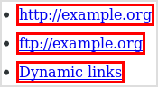

# Insecure Links Highlighter 

Easily notice insecure links in Firefox by their bright red border:

Highlights insecure links such as:

- HTTP
- FTP
- [Dynamic links](#dynamic-links)
- And more

## Download

[Firefox add-on](https://addons.mozilla.org/en-US/firefox/addon/insecure-links-highlighter/)

## Build

    make

Dependencies:

- GNU Make
- ImageMagick
- OptiPNG
- Zip

## Test

    make test
    docker-compose stop

Dependencies:

- Docker Compose
- GNU Make

## Release

1. Update version in [manifest.json](manifest.json)
1. Make sure the project builds:

        make clean build test
1. Commit changes
1. Tag the release:

        git tag $(jq -r .version < manifest.json) -m "Release"
1. Push the changes:

        git push
        git push --tags
1. Create the change log:

        make CHANGELOG_GITHUB_TOKEN=[your token] changelog
1. [Upload](https://addons.mozilla.org/en-US/developers/addon/insecure-links-highlighter/versions/submit/) the new .xpi
1. Submit the change log markup

Dependencies:

- [GitHub token](https://github.com/settings/tokens/new). See the [GitHub Changelog Generator documentation](https://github.com/skywinder/github-changelog-generator#github-token) for details.
- jq
- Build and test dependencies (see above)

## Dynamic links

These are links which execute code when certain things happen, such as clicking a link. This does have legitimate and safe uses, but even the world's biggest search engine uses it sneakily: when you move the mouse over a link anywhere on the web, Firefox displays the URL it expects to go to when that link is clicked. But dynamic links often go to a different page first, for example to keep track of which links you have clicked. Seeing the wrong link in the browser therefore gives a false sense of privacy and security.

## [License](LICENSE)

GNU GPL version 3 or later.

## Acknowledgements

Special thanks to [Catalyst](https://catalyst.net.nz/) for letting me work on this between projects.
